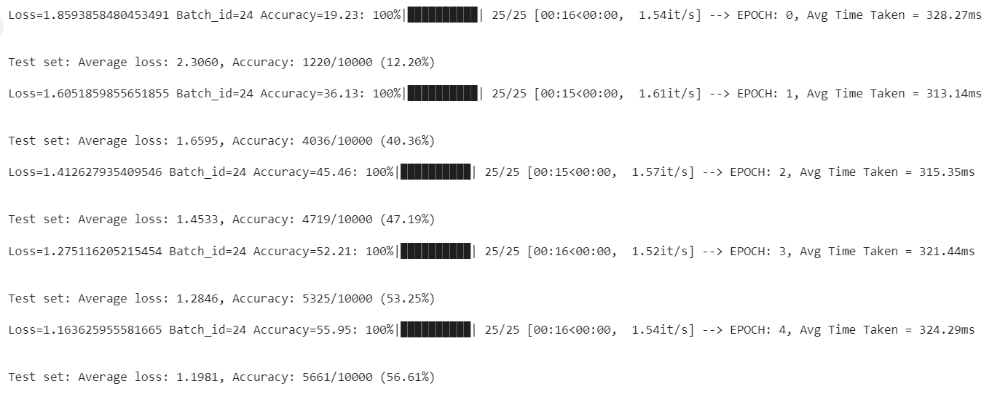
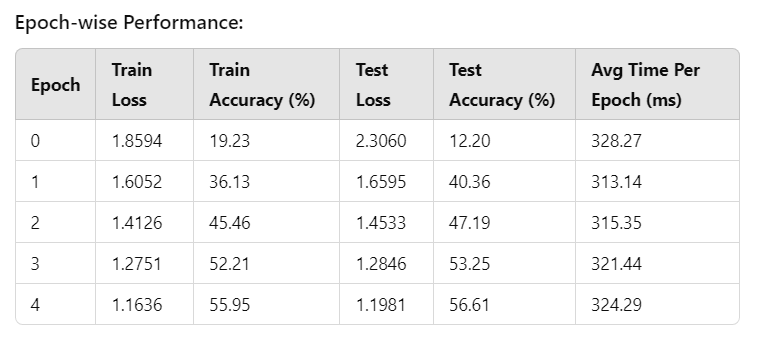
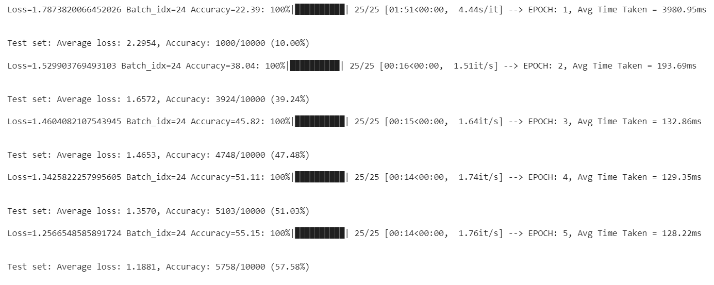
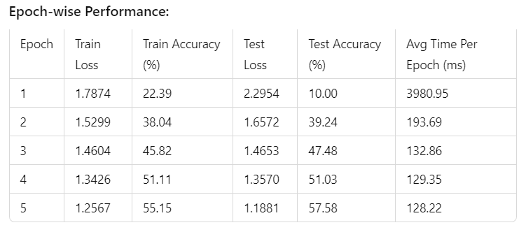
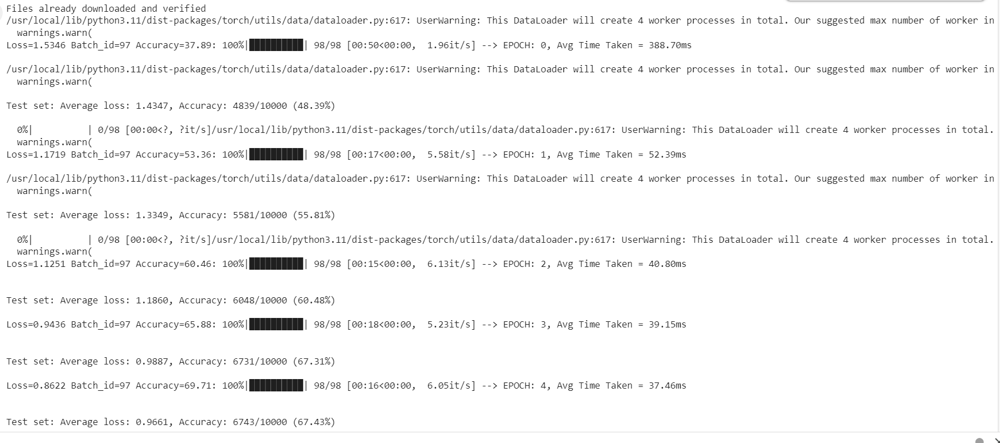
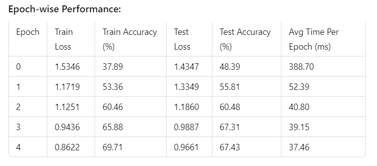

# EPAiV5-Session28 - Optimized Training for Efficient Deep Learning

## Overview

This notebook demonstrates various optimization techniques for accelerating deep learning training. The model used to study these optimization strategies is ResNet10 on CIFAR10 dataset. We compare training performance with and without optimizations and analyze their impact on speed and accuracy.

## Optimization Techniques Used

The following strategies are implemented in this notebook to improve training efficiency:

1. Utilizing GPUs and Mixed Precision Training

- Uses torch.amp.autocast for float16 mixed precision.

- Reduces memory usage and accelerates computations.

- Implemented in Train with Optimization 1 and Train with Optimization 2 (Sections in the notebook: `Train with Optimization 1` and `Train with Optimization 2`).

2. Applying torch.compile for Kernel Fusion

- Reduces Python overhead and enables faster execution.

- Implemented in `Train with Optimization 1` and retained in `Train with Optimization 2` (Refer to the notebook: `torch.compile(model)`).

3. Optimizing Hyperparameters

- Uses `OneCycleLR` for dynamic learning rate scheduling.

- Enhances convergence.

- Implemented in `Train with Optimization 2` (Refer to the notebook).

4. Employing Optimizers

- Uses torch.optim.AdamW for efficient updates.

- Note: The optimizer used in Optimization 1 is not a fused variant (i.e., it is standard AdamW, not FusedAdamW).

- Implemented in `Train with Optimization 1` and `Train with Optimization 2`.

5. Using torch.backends.cudnn.benchmark = True

- Enables faster GPU operation selection.

- Implemented in `Train with Optimization 1` and retained in `Train with Optimization 2`.

6. Implementing Gradient Accumulation

- Helps train with larger batch sizes without exceeding memory limits.

- Implemented in `Train with Optimization 2`.

7. Data Loading Optimization

- Increased batch size to 2048

- Enabled pin memory and non-blocking transfers

## Performance Comparison

### Without Optimization

- Time per Epoch: ~324.29ms

- Training Accuracy: ~53.25% (Epoch 5)

- Training Speed: 1.54 it/s
  
- Test Accuracy: ~56.61% (Epoch 5)

#### Training Logs

### With Optimization 1 (`torch.compile`, Mixed Precision, Optimized AdamW, `cudnn.benchmark`)

- Time per Epoch: Reduced to ~128.22ms (in 5th epoch from ~3980.95ms of the initial epoch. Time taken in the initial epoch is due to compilation overhead)

- Training Accuracy: ~55.15% (Epoch 5)

- Training Speed: 1.76 it/s

- Test Accuracy: ~57.58% (Epoch 5)

- Speed Improvement

    - Initial epoch shows high time (3980.95ms) due to compilation overhead

    - Stabilized training time after compilation

    - Subsequent epochs show ~2.5x speedup (from ~324.29ms to ~128.22ms per batch)

#### Training Logs

### With Optimization 2 (OneCycleLR, Gradient Accumulation added)

- Improved Convergence: Faster accuracy improvement

- Training Stability: Better handling of large batch sizes due to gradient accumulation

- Further Efficiency Gains: Retains all previous optimizations while enhancing learning dynamics

- Data Loading Optimization:
    - Better data augmentation
    - Proper CIFAR10 normalization
    - Efficient prefetching
    - Non-blocking data transfers

- Memory Efficiency:
    - set_to_none=True for gradient zeroing
    - Proper memory pinning
    - Efficient data transfer

- Training Optimization:
    - AdamW optimizer for better convergence
    - OneCycleLR scheduler
    - Proper learning rate scaling
    - Reduced compilation overhead

- Mixed Precision:
    - Simplified autocast implementation
    - More efficient scaler usage

- This approach provided:
    - More consistent training times
    - Better memory utilization
    - Improved convergence
    - Reduced overhead

- Time per Epoch: Reduced to ~37.46ms (in 5th epoch from ~388.70ms of the initial epoch. Time taken in the initial epoch is due to compilation overhead)

- Training Accuracy: ~69.71% (Epoch 5)

- Training Speed: 6.05 it/s

- Test Accuracy: ~67.43% (Epoch 5)

- Speed Improvement

    - Initial epoch shows high time (388.70ms) due to compilation overhead

    - Stabilized training time after compilation

    - Subsequent epochs show ~8.66x speedup (from ~324.29ms to ~37.46ms per batch)

  
#### Training Logs

## Areas for Further Improvement

1. Employing Fused Optimizers:

A fused variant of AdamW (e.g., `torch.optim.AdamW(fused=True)` or `FusedAdamW` from `apex.optimizers`) can provide better performance by optimizing parameter updates on GPUs.

This can be integrated into future iterations of the training pipeline.

2. Check with using BFP16:

The precision FP16 is used in the current implementation. It can be replaced with BFP16 to see if it provides better performance. Due to the lack of GPU support for BFP16 in Colab, it is not used and tested with the current implementation.

## Conclusion

Applying `torch.compile`, mixed precision, learning rate schedules, and gradient accumulation significantly accelerated training while maintaining accuracy. The optimizations significantly improved both accuracy and training speed. Optimization 2 provided the best trade-off, achieving the highest accuracy (67.43%) and the fastest training time (~40ms per epoch). These optimizations make deep learning models more computationally efficient without sacrificing performance. 
